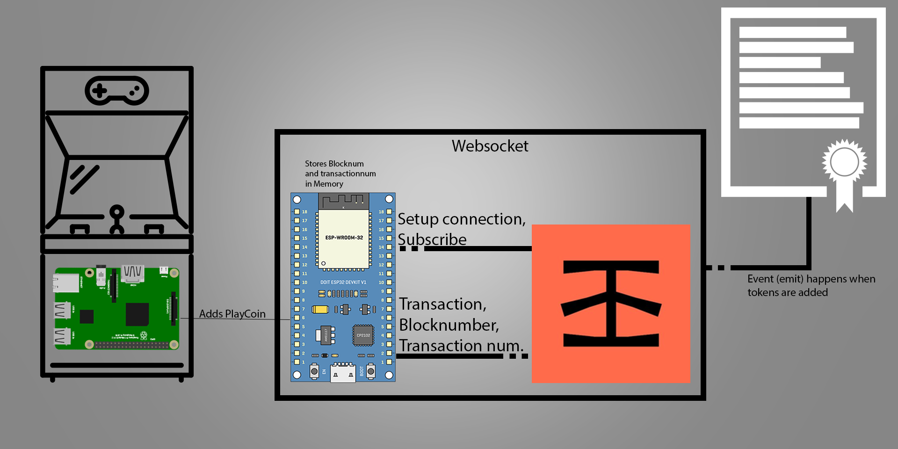

<h1>Ethereum arcade machine</h1>
This github page is for the ethereum arcade machine.
 
 
 

<h2>Prerequisites</h2>

Platformio is recommended.

In platformio use the included platformio.ini it will add: 

<ul>
  <li>ArduinoWebsockets by Gil Maimon</li>
  <li>ArduinoJson by Benoit Blanchon</li>
  <li> </li>
</ul>

 a external library is used for the liquid crystal. <a href="https://bitbucket.org/fmalpartida/new-liquidcrystal/downloads/">Liquid Crystal Library</a>

<h2>Git guide</h2>
https://rogerdudler.github.io/git-guide/index.nl.html
 
 

<h2>Design</h2>

<h2>Installation</h2>
